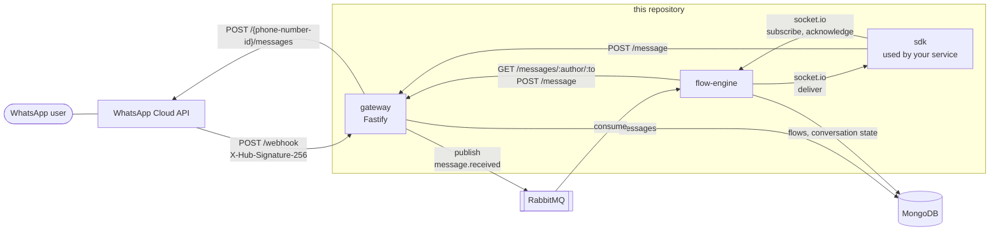

# whatsapp-flow

A small backend for building WhatsApp conversations on top of the
[WhatsApp Cloud API](https://developers.facebook.com/docs/whatsapp/cloud-api).
A **gateway** receives Meta's webhooks, verifies their signature, stores every
message and publishes inbound ones to RabbitMQ. A **flow-engine** consumes
them and answers by walking a conversation flow stored as a graph of nodes,
keeping each user's position in MongoDB. An **SDK** lets another Node.js
service send messages through the gateway and take over specific inbound
messages over socket.io instead of letting a flow answer them.

The two services only share RabbitMQ and HTTP, so the part that talks to Meta
stays thin and the conversation logic can be changed, restarted or replaced
without touching webhook handling.

## Architecture



What happens when a user writes to the business number:

1. Meta calls `POST /webhook` on the gateway. The gateway checks the HMAC
   signature of the raw body against the app secret and rejects anything else.
2. Each user message in the notification is stored in MongoDB and published to
   the `messages` exchange with routing key `message.received`.
3. The flow-engine consumes the message and asks the gateway for the user's
   recent messages. If the last five text messages are identical it stops
   there (a guard against loops with another bot).
4. If a socket.io client subscribed to this kind of message, the engine
   delivers it and waits up to five seconds for an acknowledgement. An
   acknowledged message is done: no flow runs for it.
5. Otherwise the engine picks a flow, advances the user's conversation and
   sends each resulting message with `POST /message` on the gateway, which
   forwards it to the Cloud API and stores it.

## Repository layout

```
apps/
  gateway/        HTTP service: webhook, send endpoint, message history
  flow-engine/    RabbitMQ consumer: flow engine and socket.io server
packages/
  sdk/            TypeScript client for the gateway and the socket.io server
  shared/         Environment loading, logger and the RabbitMQ contract
docker-compose.yml  MongoDB and RabbitMQ for local development
.github/workflows/  CI: install, build, typecheck, lint, test
```

Both apps follow the same ports-and-adapters layout:

```
src/
  domain/        entities and rules, no I/O
  application/   use cases and the ports (interfaces) they depend on
  drivers/       adapters: MongoDB, RabbitMQ, HTTP clients, socket.io, HMAC
  interface/     HTTP controllers, DTOs and mappers (gateway only)
  config/        typed configuration read from the environment
  main.ts        wiring
```

## How a conversation is modeled

A flow is one document in the `flows` collection: a graph plus the rules that
select it. This is a shortened version of
[`apps/flow-engine/examples/welcome-flow.json`](apps/flow-engine/examples/welcome-flow.json):

```json
{
  "_id": "welcome-flow",
  "author": "admin",
  "name": "Welcome",
  "number": "15550001111",
  "search": [
    { "type": "default", "value": "" },
    { "type": "equals", "value": "menu" }
  ],
  "content": {
    "nodes": [
      {
        "id": 0, "name": "Greeting", "x": 0, "y": 0,
        "extra": {
          "type": "text",
          "value": { "messages": [{ "type": "text", "value": "Hi! Thanks for getting in touch." }] }
        }
      },
      {
        "id": 1, "name": "Menu", "x": 240, "y": 0,
        "extra": {
          "type": "interaction",
          "value": {
            "value": "What do you need?",
            "action": {
              "type": "button",
              "value": [{ "value": "Opening hours" }, { "value": "Talk to us" }]
            }
          }
        }
      },
      {
        "id": 2, "name": "Opening hours", "x": 480, "y": 0,
        "extra": {
          "type": "text",
          "value": { "messages": [{ "type": "text", "value": "We are open Monday to Friday." }] }
        }
      }
    ],
    "links": [
      { "nodes": [{ "id": 0, "componentIndex": 0 }, { "id": 1, "componentIndex": 0 }] },
      { "nodes": [{ "id": 1, "componentIndex": 0 }, { "id": 2, "componentIndex": 0 }] }
    ]
  }
}
```

**Nodes.** `extra.type` decides what a node does. The node with id `0` is
where every conversation starts; `x` and `y` are canvas coordinates kept for
whatever tool drew the flow and are ignored by the engine.

| Node type     | `extra.value`                                             | Behavior |
| ------------- | --------------------------------------------------------- | -------- |
| `text`        | `messages`: list of `{ type, value }`                     | Sends the messages in order. Item types: `text`, `question`, `template` (template name), `delay` (seconds), `audio` / `video` / `image` (media id). If the last item is a `question` the engine waits for the answer, otherwise it continues to the next node immediately. |
| `interaction` | `value` (body), `action`, optional `header` and `footer`  | Sends reply buttons, or a list menu when `action.type` is `list`, and waits for the user to choose. |
| `delay`       | `delay`: seconds                                          | Waits, then continues to the next node. |

**Links.** A link is a directed edge: `nodes[0]` is the source and `nodes[1]`
the target. For a link leaving an interaction node, the `componentIndex` of
the source is the index of the option it belongs to, so each button or list
row can lead to a different node. Other nodes have at most one outgoing link.
A node without outgoing links ends the conversation. Cycles are allowed as
long as the loop passes through a node that waits for the user.

**Selecting a flow.** `number` is the business phone number the flow answers
for. For an inbound message the engine considers the flows of the number that
was contacted and picks, in this order:

1. a flow with a keyword trigger (`equals`, `contains`, `startsWith`) matching
   the text the user sent, or the title of the button they tapped;
2. the flow of the conversation the user has in progress;
3. a fallback: the flow with a `default` trigger if this is the first message
   the user ever sent, the flow with a `state` trigger otherwise.

If nothing applies the message is left unanswered.

**State.** A conversation is one document in `flow_states`, identified by user
number and flow id. It does not store "current node": it stores the list of
transitions taken from the start node, and the engine replays them against the
flow on every message.

```json
{
  "_id": "665f1c2e9b1d4a0012ab34cd",
  "flowId": "welcome-flow",
  "number": "15550002222",
  "steps": [
    { "next": "default", "response": "" },
    { "next": "Opening hours", "response": "Opening hours" }
  ]
}
```

`next` is the key of the link that was followed (`default`, or the label of
the chosen option) and `response` is what the user sent, empty for transitions
the engine made on its own. On an interaction node, an answer that is not one
of the options leaves the conversation where it is and nothing is sent. When
the conversation reaches a node with no way out, the state document is
deleted.

## Quick start

Requirements: Node.js 22 or newer, pnpm 9, Docker.

```bash
pnpm install
docker compose up -d                     # MongoDB and RabbitMQ

cp apps/gateway/.env.example apps/gateway/.env
cp apps/flow-engine/.env.example apps/flow-engine/.env
# Edit both files. API_KEY (gateway) and GATEWAY_API_KEY (flow-engine) must match.

pnpm dev                                 # gateway on :3000, socket.io on :3001
```

Load the example flow after changing its `number` to your business number
(digits only, as Meta reports it in `display_phone_number`):

```bash
docker compose exec -T mongodb mongoimport --db whatsapp-flow --collection flows \
  < apps/flow-engine/examples/welcome-flow.json
```

To receive real messages, expose the gateway on a public HTTPS URL and
configure `https://<host>/webhook` as the callback URL of your Meta app,
subscribed to the `messages` field. See [Limitations](#limitations) about the
verification request Meta sends when you save that URL.

To exercise the pipeline without Meta, send the gateway a notification signed
with your `META_APP_SECRET`:

```bash
export META_APP_SECRET=your-meta-app-secret   # same value as in apps/gateway/.env
BODY='{"entry":[{"changes":[{"value":{"metadata":{"display_phone_number":"15550001111"},"messages":[{"from":"15550002222","type":"text","text":{"body":"hi"}}]}}]}]}'
SIGNATURE=$(printf '%s' "$BODY" | openssl dgst -sha256 -hmac "$META_APP_SECRET" | sed 's/^.* //')

curl -X POST http://localhost:3000/webhook \
  -H 'Content-Type: application/json' \
  -H "X-Hub-Signature-256: sha256=$SIGNATURE" \
  -d "$BODY"
```

The message is stored, published and picked up by the flow-engine. Its answer
then fails at the last hop unless the credentials in
`apps/flow-engine/.env` are real, or `WHATSAPP_API_URL` in the gateway points
at a stub.

Other commands, all run from the repository root:

| Command          | What it does                                       |
| ---------------- | -------------------------------------------------- |
| `pnpm build`     | Compiles every package to `dist/`                  |
| `pnpm test`      | Runs the Jest suites of every package              |
| `pnpm lint`      | Runs ESLint on every package                       |
| `pnpm typecheck` | Type-checks sources and tests without emitting     |
| `pnpm format`    | Formats the repository with Prettier               |

Each app has a multi-stage `Dockerfile` built from the repository root, for
example `docker build -f apps/gateway/Dockerfile -t whatsapp-flow-gateway .`.

Each app and package has its own README with its configuration and API:
[gateway](apps/gateway/README.md), [flow-engine](apps/flow-engine/README.md),
[sdk](packages/sdk/README.md), [shared](packages/shared/README.md).

## Testing

`pnpm test` needs no network, MongoDB or RabbitMQ. Use cases are tested
through their ports with in-memory fakes; module-level mocks are limited to
the socket layer of the SDK.

- **gateway**: signature validation, webhook payload mapping, the receive and
  send use cases, and the HTTP API end to end (authentication, signature
  handling, status codes) through Fastify's request injection.
- **flow-engine**: flow triggers, variable substitution, the three node
  processors, graph navigation, replaying state, cyclic flows; then the
  application layer as a whole, from an inbound message to the messages
  handed to the sender port. Driver code that holds logic is covered too: the
  RabbitMQ acknowledgement rules, the socket.io subscription registry and
  protocol, the mapping to SDK messages, and the Mongoose schemas (validated
  without a database).
- **sdk**: message builders and their serialized payloads, sender selection,
  client configuration, and the socket client's subscribe / acknowledge /
  reconnect behavior.
- **shared**: environment helpers and the Secret Manager loader against a fake
  client.

Not covered by automated tests: the Mongoose repositories and the amqplib
connection code against real servers, and anything involving the real Cloud
API.

## Limitations

- **A Meta WhatsApp Business account is required** to run this end to end: an
  app secret, a phone number ID and an access token. Without them you can run
  everything up to the call to the Cloud API.
- **No webhook verification endpoint.** When a callback URL is saved, Meta
  sends a `GET` request with `hub.challenge` and expects it echoed back. The
  gateway only implements `POST /webhook`, so that handshake has to be added
  (or answered by something in front of the gateway) before Meta will deliver
  notifications.
- **No flow editor and no API to manage flows.** Flows are MongoDB documents
  you write by hand or with your own tooling.
- **The engine understands three inbound message types**: text, interactive
  replies (buttons and lists) and template quick-reply buttons. Images, audio,
  locations and the rest are stored by the gateway and skipped by the engine.
- **No retries.** A message whose handling fails in the flow-engine is logged
  and dropped; there is no dead-letter queue. Webhook deliveries are not
  deduplicated, so a notification Meta retries is processed twice.
- **Delays block the consumer.** The flow-engine handles one message at a time
  and a delay is an in-process wait, so a delay in one conversation holds back
  all others and is lost if the process restarts.
- **One flow-engine instance.** Socket subscriptions live in memory and
  conversation state is not created atomically, so running several instances
  would misbehave.
- **`${name}` placeholders are not filled in.** The flow domain substitutes
  variables when it is given some, but the application does not supply any
  yet, so placeholders are sent as written.
- **Keyword triggers are case-sensitive** and compare against the raw text.
- **One sender number per flow-engine**, taken from its environment.
- **The gateway does not hold Meta credentials.** Callers of `POST /message`
  send the access token with every request, and the gateway's API key is a
  single shared secret. There is no rate limiting.
- **No reconnection to RabbitMQ.** If the connection drops, the process has to
  be restarted.
- **Not run against the live Cloud API in this form.** The payloads follow
  Meta's documented format and the services are tested against each other
  locally, but the default Graph API version in `WHATSAPP_API_URL` should be
  checked against the versions Meta currently supports.

## License

[MIT](LICENSE)
